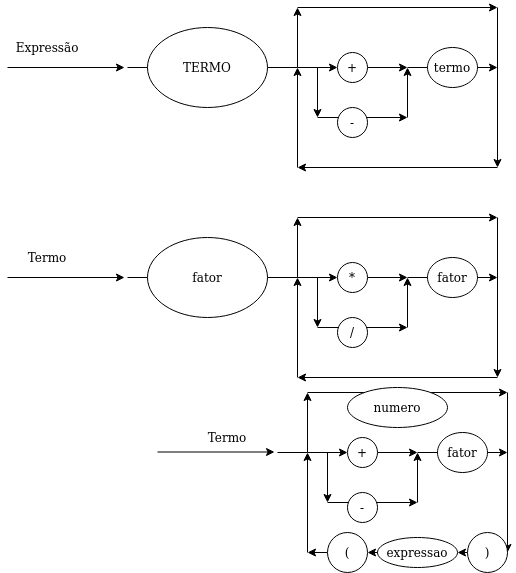

## Gramática
G = ({E, T, F, +, -, *, /, (, ), n}, {+, -, *, /, (, ), n}, P, E)

## EBNF
- expressão = termo, { (“+” | “-”), termo } ;
- termo = fator, { (“*” | “/”), fator } ;
- fator = (“+” | “-”) fator, número, “(” expressão “)” ;
- número = “-2^63” | ... | “2^63” ;

## Diagrama Sintático
